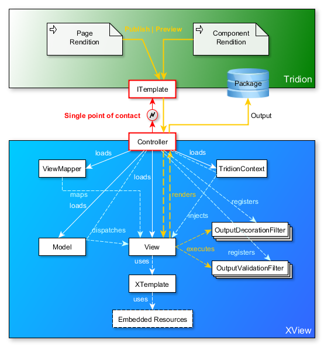

# XView Code Samples
This project provides code samples to illustrate the usage of XView.

The concept of XView is different from those of other conventional Tridion templating solutions. Read about the XView basic concept below to get started.

# XView Basic Concept
Before diving into XView coding it would be good to know about the basic concept of XView.



## View and Model
Tridion templating essentially involves developing Page Templates to render Pages and Component Templates to render Components.

In XView **View** classes are mapped with **Page Templates** and **Component Templates**. Each View class can be mapped to one or more Templates.

A **Page** or a **Component** is by default dispatched to the View as a **Model**. The dispatching is done by the Controller. See Controller section below.

[Example View class](https://github.com/hoangchu/xview-codesamples/blob/master/Source/Templating/Views/ComponentViews/ArticleView.cs).

## Context
The rendition of a Component or Page always take place inside a **Publication**. This Publication is part of a **Blueprint**. (Be it a single Publication Blueprint). A Blueprint exists in a **Tridion Content Manager instance** which runs inside an **environment** (as in DTAP).

Common business rules and high-level content structures are normally defined on Publication and Blueprint level. For example, in a multilingual website implementation there are always notions of countries and languages. Countries and languages information is defined on Blueprint level and localized in each Publication.  

In XView the **TridionContext** class embodies the context in which a Page or a Component rendition takes place. The TridionContext **encapsulates** and **exposes** the **common business rules**, **high-level content structures** and **configurations**, and **environment data**.

The TridionContext object is loaded and injected into the View to make it "context aware".

The default TridionContext class contains properties and methods that are applicable to all Tridion implementations. XView allows to extend the TridionContext. It should be a common thing to extend the TridionContext to implement project specific business rules and configurations.

[Example TridionContext derived class](https://github.com/hoangchu/xview-codesamples/blob/master/Source/Templating/Controllers/IntranetContext.cs).

## Controller
Templates in Tridion are called Compound Templates. Each Compound Template can contain one or more Template Building Blocks (TBB). A TBB contains logic to render output for a Page or a Component. The TBBs in a Compound Template get executed in the order in which they're added.

In XView each **Compound Template** has **one TBB**. The same TBB is used on all Compound Templates inside a same Blueprint. (The Context). This TBB is the **Controller** in XView.

The Controller in XView is a [Front Controller](https://en.wikipedia.org/wiki/Front_Controller_pattern). It interfaces with Tridion via the ITemplate interface. A Controller is responsible for tasks including the following.

- Decoupling Tridion (to allow development and maintenance of Template logic and layouts outside of Tridion).
- Controlling the execution flow of a rendition.
- Mapping Templates with Views using a ViewMapper.
- Loading TridionContext and injecting it into Views
- Dispatching Models to Views
- Rendering Views & returning View outputs to Tridion.

In XView the single thing that is mandatory is to create a `Controller` derived class inside a `[Project root namespace].Controllers` namespace. This derived Controller is the TBB used on all Templates inside the same Blueprint.

[Example Controller derived class](https://github.com/hoangchu/xview-codesamples/blob/master/Source/Templating/Controllers/IntranetController.cs).

## ViewMapper
Each Compound Template in Tridion is mapped with a View class in an XView class library implementation. The mapping is done by the default ViewMapper via the Controller. The default view mapping logic is based on Template and View naming convention.

Examples:

- A Component Template named `Article` will be mapped with a View named `ArticleView`. This View's full name is `[Project root namespace].Views.ComponentViews.ArticleView`.

- A Page Template named `Xml` will be mapped with a View named `XmlView`. This View's full name is `[Project root namespace].Views.PageViews.XmlView`.

It is possible to provide custom view mapping logic by creating a ViewMapper derived class and override a specific method or by creating a new class that implements the IViewMapper interface.

[Example ViewMapper derived class](https://github.com/hoangchu/xview-codesamples/blob/master/Source/Templating/Controllers/IntranetViewMapper.cs).

## Output Filters
Output decoration and output validation are among the things you often see in a Tridion templating implementation. 

XView provides a convenient and centralized way to decorate output with **OutputDecorationFilter**s and validate output with **OutputValidationFilter**s.

You can create filter classes derived from `OutputDecorationFilter` or `OutputValidationFilter` and specify which `ViewOutputType` to apply the filtering to. (Eg. Html, Xml, Css, Json, etc.). A filter class can handle one or more `ViewOutputType`. The filter will be applied to output of `View`'s that have a matching `ViewOutputType`. (In a `View` class you can explicitly specify a `ViewOutputType` through the `View.OutputType` property. By default `ViewOutputType.Html` is returned for `View.OutputType` when not explicitly specified.

OutputDecorationFilter and OutputValidationFilter derived classes can be registered inside the Controller to perform output filtering. 

[Example of an OutputDecorationFilter class](https://github.com/hoangchu/xview-codesamples/blob/master/Source/Templating/DecorationFilters/DefaultFinishActionsDecorationFilter.cs).

[Example of an OutputValidationFilter class](https://github.com/hoangchu/xview-codesamples/blob/master/Source/Templating/ValidationFilters/HtmlValidationFilter.cs).

[Example of how to register OutputDecorationFilter or OutputValidationFilter derived types inside a Controller](https://github.com/hoangchu/xview-codesamples/blob/master/Source/Templating/Controllers/IntranetController.cs).

## XTemplate: Clean C# and HTML
Generation of HTML output is one the essential things that you do in a Tridion templating implementation. 

In XView HTML output can be generated cleanly inside a View (C# class) by loading and parsing a separate HTML template using XTemplate. HTML templates are added as .html embedded resource files to the class library. Visual Studio provides a convenient way to expose/access embedded resource via a resource Xml file (resx).

The syntax used in HTML template and interpreted by XTemplate are simple. There are only three tags you need to learn; a variable tag, a block begin and block end tag.

### Variable
Variables are specified in the HTML template to be assigned values by the C# code. You specify a variable by specifying a name surrounded by an open and a close curly brace. See the examples below.

- `{Title}`
- `{Introduction}`
- `{VariableName}`

### Block
A block is an HTML snippet that can either be either omitted or parsed to add to the output. The same block can be parsed multiple times. For example in a iteration you want to output the same HTML snippet multiple times, but each  with different content.

A block has a begin and an end tag. Blocks can be nested. See example below.

```html
<!-- BEGIN: anchors -->
<ul>
	<!-- BEGIN: anchor -->
	<li><a href="#{ParagraphIndex}">{ParagraphTitle}</a></li>
	<!-- END: anchor -->
</ul>
<!-- END: anchors -->
```

C# code
```csharp
XTemplate xt = new XTemplate(Layout.Article);

...

IList<ItemFields> paragraphs = fields.GetEmbeddedFields("paragraphs");
int paragraphIndex = 0;

foreach (ItemFields paragraph in paragraphs)
{
	paragraphIndex++;
	string paragraphTitle = paragraph.GetText("title);

	xt.ParagraphIndex = paragraphIndex.ToString();
	xt.ParagraphTitle = paragraphTitle;
	xt.Parse("root.anchors.anchor");
}

xt.Parse("root.anchors");

...

return xt.ToString();
```


[Example C# View class](https://github.com/hoangchu/xview-codesamples/blob/master/Source/Templating/Views/ComponentViews/ArticleView.cs)

[Example HTML template](https://github.com/hoangchu/xview-codesamples/blob/master/Source/Templating/Views/ComponentViews/Layout/ArticleView.html)
